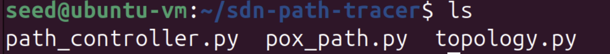
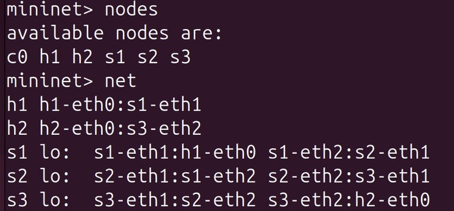
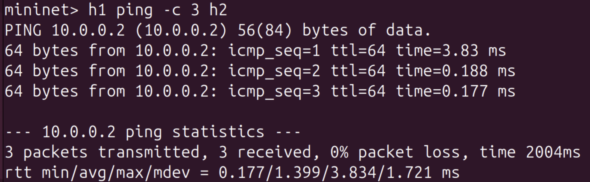
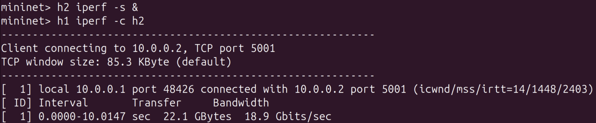
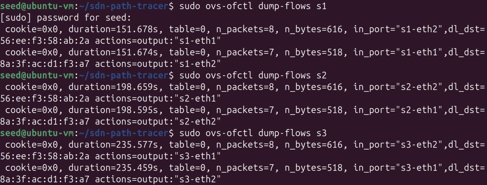
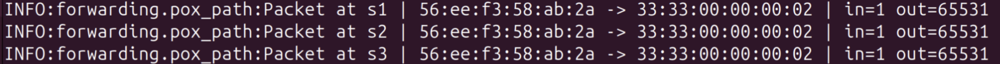
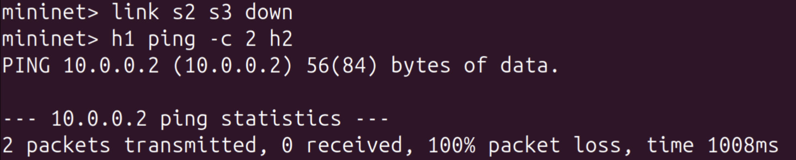
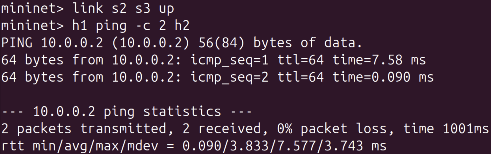

# SDN Path Tracer using POX and Mininet

## Project Overview

This project demonstrates a Software Defined Networking (SDN) implementation using the POX controller and Mininet network emulator.

The controller dynamically learns host locations, installs OpenFlow rules in switches, and forwards packets intelligently across the network.

---

# 1. Problem Statement

Traditional networks depend on static forwarding behavior and manual configuration. SDN separates the control plane from the data plane, enabling programmable and centralized network management.

The objective of this project is to:

- Build a custom SDN controller using POX
- Create a custom Mininet topology
- Learn source MAC addresses dynamically
- Forward packets intelligently
- Install flow rules in switches
- Observe traffic behavior using logs
- Measure latency and throughput
- Demonstrate link failure and recovery

---

# 2. Technologies Used

- Python
- POX Controller
- Mininet
- Open vSwitch
- OpenFlow 1.0
- Ubuntu/Linux Environment
- GitHub

---

# 3. Project Files

## topology.py
Defines the custom Mininet topology with:

- 2 Hosts → h1, h2
- 3 Switches → s1, s2, s3

Connection path:
h1 → s1 → s2 → s3 → h2

## pox_path.py
Custom POX controller that performs:

- PacketIn handling
- MAC learning
- Flow rule installation
- Flooding for unknown destinations
- Packet path logging

---

# 4. Network Topology

```text
h1 ---- s1 ---- s2 ---- s3 ---- h2
```

**Custom Topology File**


---

# 5. Setup and Installation Steps

## Step 1: Install Required Tools

Install:

- Python
- Git
- POX
- Mininet
- Open vSwitch

## Step 2: Clone POX Repository

```bash
git clone https://github.com/noxrepo/pox.git
```

## Step 3: Place Controller File

Copy `pox_path.py` into:
pox/pox/forwarding/

## Step 4: Run POX Controller

```bash
cd ~/pox
./pox.py log.level --DEBUG openflow.of_01 forwarding.pox_path
```


## Step 5: Run Mininet Topology

```bash
sudo mn --custom topology.py --topo mypath --controller remote
```


---

# 6. Source Code Explanation

## topology.py Logic

- Creates two hosts
- Creates three switches
- Adds links in linear order
- Registers custom topology as `mypath`

## pox_path.py Logic

### MAC Learning

Stores source MAC address and incoming port:

```python
mac_to_port[dpid][src] = in_port
```

### Known Destination

If destination MAC is known:

- Determine output port
- Install flow rule
- Forward packet directly

### Unknown Destination

If destination MAC is unknown:

- Flood packet to discover host

### Logging

Logs switch ID, source, destination, input port, output port.

---

# 7. Working Demonstration

## Test 1: Node Verification

Command:

```bash
nodes
```

Expected devices:

- h1
- h2
- s1
- s2
- s3
- c0

**Nodes**



---

## Test 2: Ping Connectivity

Command:

```bash
h1 ping -c 3 h2
```

Expected Result:

- Successful packet delivery
- 0% packet loss

**Ping Output**



---

## Test 3: Throughput Measurement

Command:

```bash
h2 iperf -s &
h1 iperf -c h2
```

Expected Result:

- High bandwidth throughput displayed

**iperf Output**



---

# 8. Flow Table Verification

After traffic generation, flow rules should be installed automatically.

Command:

```bash
sudo ovs-ofctl dump-flows s1
sudo ovs-ofctl dump-flows s2
sudo ovs-ofctl dump-flows s3
```

Expected Result:

- Match fields present
- Output actions present
- Dynamically installed flows visible

**Flow Table - s1,s2,s3**



---

# 9. Logging / Monitoring Output

The controller logs packet movement through switches.

Example:
Packet at s1 | src -> dst | in=2 out=1

Packet at s2 | src -> dst | in=1 out=1

Packet at s3 | src -> dst | in=1 out=65531

This confirms packet traversal and forwarding decisions.

**Controller Logs**



---

# 10. Link Failure Testing

A network failure is simulated by disabling the link between s2 and s3.

Command:

```bash
link s2 s3 down
h1 ping -c 2 h2
```

Expected Result:

- Ping fails
- 100% packet loss

**Link Down Test**



---

# 11. Link Recovery Testing

Restore the failed link.

Command:

```bash
link s2 s3 up
h1 ping -c 2 h2
```

Expected Result:

- Connectivity restored
- Ping successful

**Link Up Recovery Test**


---

# 12. Performance Observation and Analysis

## Latency Analysis

Using ping:

- First packet may have higher delay due to controller processing
- Later packets are faster due to installed flows

## Throughput Analysis

Using iperf:

- High bandwidth achieved after flow setup

## Flow Table Analysis

Flow entries reduce repeated controller involvement.

## Logging Analysis

Logs confirm path traversal and switch behavior.

---

# 14. Conclusion

The project successfully demonstrates:

- Learning switch behavior
- Dynamic forwarding
- Flow rule installation
- Logging and monitoring
- Connectivity testing
- Performance measurement
- Link failure handling
- Link recovery

SDN enables programmable and centralized network control. Using POX and Mininet, dynamic packet forwarding and automated flow management implemented successfully.

The controller learns host locations, installs forwarding rules, logs packet movement, and responds correctly during topology changes.

# 15. How to Run the Project

## Start Controller

```bash
cd ~/pox
./pox.py log.level --DEBUG openflow.of_01 forwarding.pox_path
```

## Start Mininet

```bash
sudo mn --custom topology.py --topo mypath --controller remote
```

## Test Connectivity

```bash
h1 ping -c 3 h2
```

## Test Throughput

```bash
h2 iperf -s &
h1 iperf -c h2
```

---

# 16. References

1. POX Controller Documentation
2. Mininet Documentation
3. OpenFlow Switch Specification
4. Python Official Documentation

---

By:
**Name:** S N Niharika
**SRN:** PES2UG24CS414
